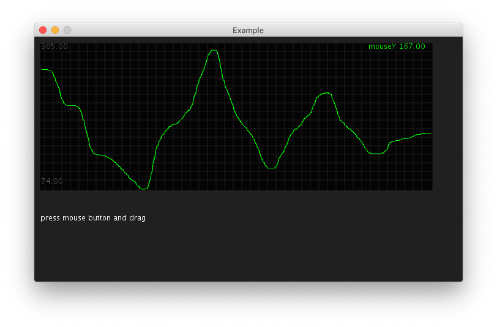

# ProcessingHistoryPlot

_[Processing](https://processing.org/) java classes inspired by armadillu's OpenFrameworks (C++) addon: [ofxHistoryPlot](https://github.com/armadillu/ofxHistoryPlot)._

## Example

A simple example can be found [here](/src/main/java/ExampleProcessingHistoryPlot/ExampleProcessingHistoryPlot.java).

